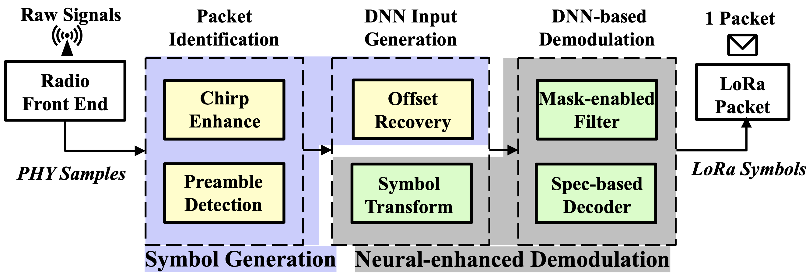

# SenSys2021-NELoRa

This repository provides the codes for our SenSys 2021 paper

This repository contains scripts and instructions for reproducing the experiments in our SenSys '21 paper "[NELoRa: Towards Ultra-low SNR LoRa Communication with Neural-enhanced Demodulation](https://cse.msu.edu/~caozc/papers/sensys21-li.pdf)".

If you have any questions or comments, please post in the Issues on Github.

**NELoRa won the Best Paper Award at SenSys '21!**

**This repo is actively maintained currently.**

Illustrated in the following figure, our repo is composed of two modules, including the Symbol Generation and the neural-enhanced demodulation. 

Please find the dataset, instruction and source code of each module in the corresponding directory.

# Notes
please consider to cite our paper if you use the code or data in your research project.
```bibtex
  @inproceedings{nelora2021sensys,
  	title={{NELoRa: Towards Ultra-low SNR LoRa Communication with Neural-enhanced Demodulation}},
  	author={Li, Chenning and Guo, Hanqing and Tong, Shuai and Zeng, Xiao and Cao, Zhichao and Zhang, Mi and Yan, Qiben and Xiao, Li and Wang, Jiliang and Liu, Yunhao},
    	booktitle={In Proceeding of ACM SenSys},
    	year={2021}
  }
```
