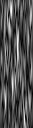
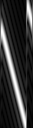
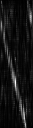
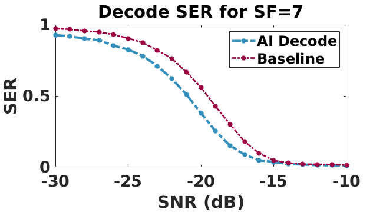

# Neural-enhanced Demodulation

This module provides the codes for our neural-enhanced demodulation, including the preprocessing for symbol transformation and DNN-based demodulation.

# Overview

- [Neural-enhanced Demodulation](#neural-enhanced-demodulation)
- [Overview](#overview)
- [Getting Started](#getting-started)
    - [Dependencies](#dependencies)
    - [Load Dataset](#load-dataset)
- [Run Experiments and Validate Results](#run-experiments-and-validate-results)
    - [From the Scratch](#from-the-scratch)
    - [Direct Inference](#direct-inference)
    - [Evaluation](#evaluation)


# Getting Started

### Dependencies
* scipy==1.0.0
* numpy==1.16.4
* torchvision==0.3.0
* PyTorch==1.7.0

### Load Dataset
1. Clone this repo: `git clone --recursive https://github.com/hanqingguo/NELoRa-Sensys.git`

2. Download the Raw Dataset from [here](https://drive.google.com/drive/folders/1iODrhHg6DmSuAGlq5eTSKClybjTLs9ot?usp=sharing)

3. Pre-process data with matlab scripts. (take SF=7, bandwidth=125k) as example:
    - specify LORA\_SF, LORA\_BW in `matlab/param_configs.m`
    - run `matlab/generation_dataset.m`, specify raw data root and generated data path.
    (__Long Process__ && __Large File__ Warning!!)
      * This script adds random Gaussian noises to original collected chirp data.
      * The file name of the generated chirp symbol follows rules as below:
      * In default, the generated dataset will be saved in `/data/Lora/sf7_125k` as following name:

    {Code} _ {SNR} _ {SF} _ {BW} _ {batch_index} _ {Code Label}_ {packet_index}_ {symbol_index}.mat

# Run Experiments and Validate Results

### From the Scratch ###
To train a model from scratch, we recommand you have a NVIDIA video card, and support cuda acceleration.

1.  Specify the root path, data path, and evaluation_dir in `config.py`
<pre>
 ├ [DIR] root_path (.)
     ┬    
     ├ [DIR] evaluations_dir
        |-[DIR] [dir_comment]\_checkpoints
        |-[DIR] [dir_comment]\_samples
        |-[DIR] [dir_comment]\_testing
        |- e.g. : sf7_v1_checkpoints
 ├ [DIR] data_dir (/data/Lora/sf7_125k)
     |- This is same as the output of the matlab script
</pre>

2. run the following command:
```
python main.py --dir_comment sf7_v1 --batch_size 16 --root_path . --data_dir /data/Lora/sf7_125k --groundtruth_code 35 --normalization --train_iter 100000 --ratio_bt_train_and_test 0.8 --network end2end
```

3. Check your loss with the std print. e.g.:
   - __Iteration [ 1000/100000] | G_Y_loss: 5.5639| G_Image_loss: 2.6935| G_Class_loss: 2.8704__
   - G_Y_loss: G_Image_loss + G_Class_loss
   - G_Image_loss: The loss between groundtruth chirp and your denoised chirp.
   - G_Class_loss: The loss of decoding correct symbol compares with the {Code Label}

4. Check your samples in [evaluations_dir]:

Example, a chirp code 24 under **-23** dB noise.

<!-- <p float="left">
  
  
  
</p> -->
|   Raw  Chirp  |  GroundTruth |  Denoised |
|:-------------:|:------------:|:---------:|
|   |   |  |


5. Get a decode result with in your `pytorch/`. Named as:
[dir_comment]\_[sf]\_[bw].mat (e.g., sf7_v1_7_125000.mat)

### Direct Inference ###

1. Download the pretrained models from [here](https://drive.google.com/drive/folders/1At3KaE4TojL8YV3YM-DrDpiwmGkiQ--B?usp=sharing)
2. run the following command:
```
python main.py --dir_comment sf7_125k --batch_size 16 --root_path . --data_dir /data/Lora/sf7_125k --groundtruth_code 35 --normalization --train_iter 0 --ratio_bt_train_and_test 0.8 --network end2end --load yes --load_iters 100000
```
3. Get a decode result with in your `pytorch/` directory.

### Evaluation ###

1. Preparation:
  - Get baseline performance:
    You can either download it from [here](https://drive.google.com/drive/folders/1iODrhHg6DmSuAGlq5eTSKClybjTLs9ot?usp=sharing), or run a baseline decode locally with our provided script:
    `matlab/generate_baseline.m`. Note that the result of abs accumulation decode method and phase compensation method reach similar decode accuracy. You can validate it with changing the `abs_decode` in our `generate_baseline.m` script. 
  - Get NELoRa performance:
  - Copy your decode result from `pytorch/*.mat` to `matlab/evaluation/`
2. Run `matlab/evaluation.m`
3. You will get the Symbol Error Rate (SER)result:
